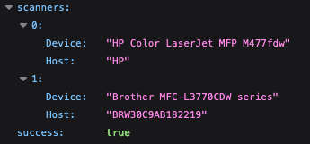

# Doc2Scan 

Doc2scan is a scanner application that **automatically** discovers scanners in your local network and allows you to easily scan documents from your computer.

## Features

- Automatically discovers scanners in your **local network**
- Scan documents and save them as PDFs
- Customize scan settings such as **resolution** and **color mode**
- Supports both **simplex** and **duplex** scanning
- Supports **multi-page scanning**
- Can be used with [DOC²](https://app.polydocs.io/) and [Alfred](https://app.polydocs.io/alfred/dashboard)

## Installation

- Download the [latest release](https://github.com/Fellow-Consulting-AG/Public-Doc2scanner/releases/latest) of your doc2scan installer from the Github Repository.
- Run the installer file depending on your Operating System.
- Follow the Steps and you should be good.

> To test it open [this webpage](https://local.polydocs.io:12500/) and see if it shows a website. If so you have setup everything correct.

## Using Doc2Scan as Standalone

Doc2Scan is not programmed to be a standalone Product. It's main use is for [DOC²](https://app.polydocs.io/) and [Alfred](https://app.polydocs.io/alfred/dashboard). However it is possible to use it as a standalone application. To do so Follow these steps.

1. Search Scanners in your local network with this URL: https://local.polydocs.io:12500/scanners

It should look something like this:

2. Copy the Host of the scanner you want to use. In my case it is `BRW30C9AB182219`
3. To do a Basic scan open this URL and replace the host with your own. 
https://local.polydocs.io:12500/scan?host=YOUR_HOST&source=platen&color=RGB24

## Scan Settings

The Scan Settings are defined in the URL. You can change them to your liking. Here is a list of all possible settings.

| Feature | Options | Description |
| ----------- | ---------------- | -----------|
| host | `Hostname` | Define the Scanner you want to use. |
| size | `A4` | Define the size of your Document. |
| color | `RGB24`, `Grayscale8` | Scan either in Color or in Grayscale. |
| source | `adf`, `platen` | Adf uses the autonatic document feeder and platen the normal flat bed scan |
| timeout | `number in ms`  | How long until doc2scan timeouts. Default is `3000` |
| duplex | `true`, `false`  | Scan both sides of documents |
| format | `any format`  | Lets you define format of outcome document. Default is `application/pdf` |

## Tested devices

If you successfully scanned documents from your device using the `Doc2scan`
example program as described above, please [send a pull
request](https://github.com/Fellow-Consulting-AG/doc2scan/edit/master/README.md) to include
your report in this table for the benefit of other interested users:

| Device Name | Working features | Known issues |
| ----------- | ---------------- | ------------ |
| Brother MFC-L2750DW | flat bed scan, automatic document feeder scan | - |

---

## License

Doc2scan is licensed under the [Polydocs TWAIN License Agreement](LICENSE).